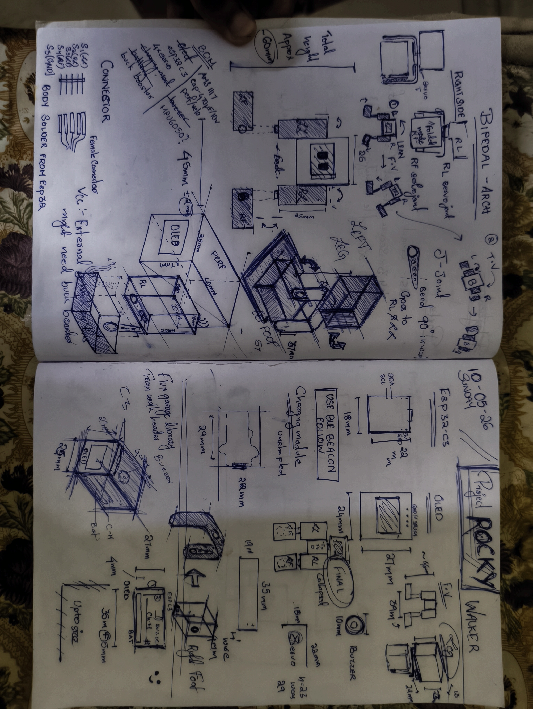
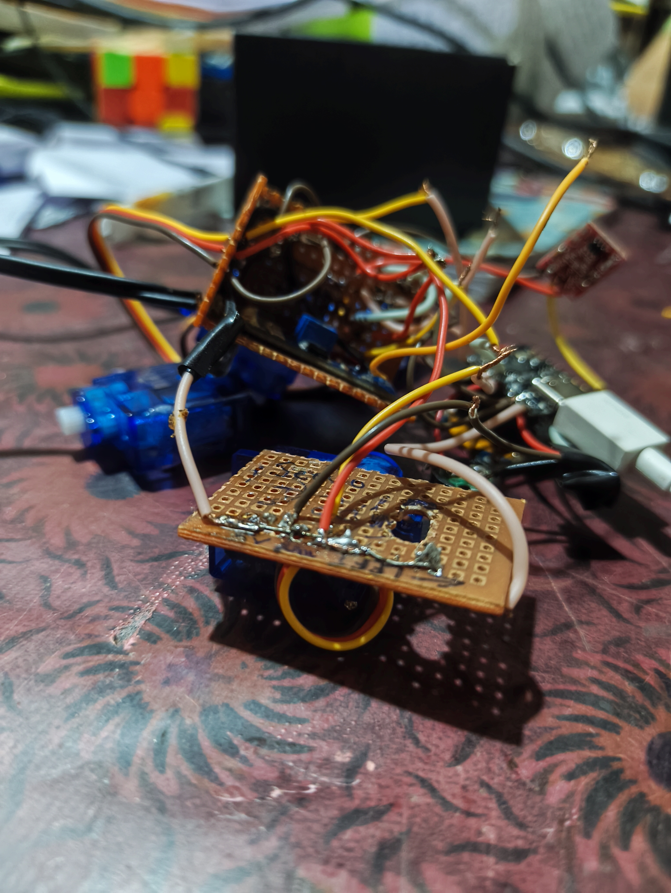
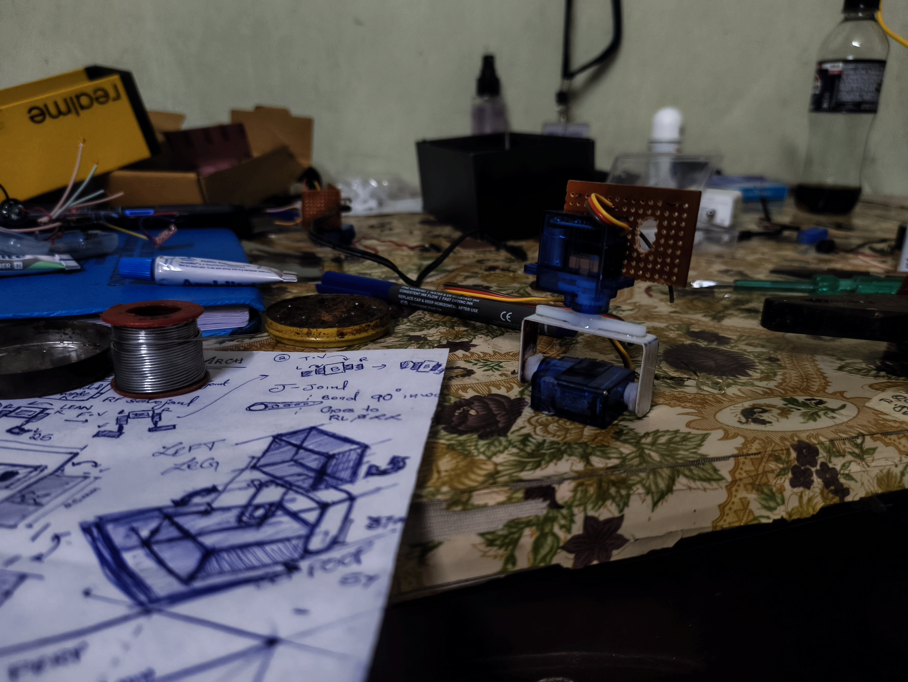
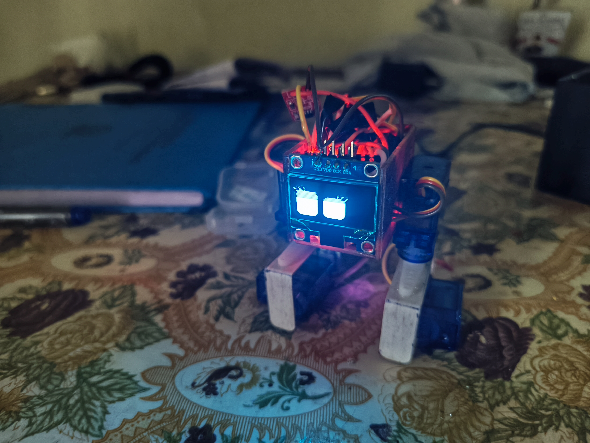

# Rocky — A BLE-Controlled Bipedal Robot

Rocky is a small bipedal robot built around an ESP32 (ESP32-C3 in this build). It walks using four servos, reacts to touch and a digital proximity/ground sensor, and can be controlled wirelessly over BLE. The project combines Arduino firmware, a servo motion engine, a Python BLE remote, and an OLED “robot eyes” display for personality.

This README is a clean summary of the build: what it does, what hardware/software is in the repo, and how the BLE control works.

## Demo

Click the thumbnail to watch the demo on YouTube.

If the preview doesn’t render in your Markdown viewer, open the link directly: [https://youtu.be/CAQG6zNMC6s](https://youtu.be/CAQG6zNMC6s)

---

## What It Can Do

- Walk forward/backward (two-step gait)
- Perform expressive actions: dance, bounce, stomp, slump, stretch, tilt
- React locally using sensors (touch + proximity/ground)
- Show mood/expressions on a 128×64 SSD1306 OLED using FluxGarage RoboEyes
- Accept BLE commands and stream simple sensor telemetry back to the BLE client

---

## Why I Built This Robot

I wanted to make something that was more than just a moving chassis. I wanted Rocky to:

- walk forward and backward,
- react to touch and near-object sensing,
- show emotion using the eye display,
- respond to commands from a BLE client (a Python controller is included),
- and feel interactive rather than just mechanical.

The result is a robot that can stand, move, dance, slump, stretch, and even appear sleepy or angry depending on what is happening.

---

## Hardware Concept

Rocky is built around an ESP32-C3 running an Arduino sketch, plus four servos and a small I2C OLED. The build shown in this repo uses:

- ESP32-C3 microcontroller (BLE server + main logic)
- 4× servos (Left Hip, Right Hip, Left Foot/Ankle, Right Foot/Ankle)
- 128×64 SSD1306 OLED (I2C) for the “eyes”
- Body/frame made from dotted vero board (perfboard)
- Touch input on a digital pin (interrupt-driven)
- Digital proximity/ground sensor input (simple HIGH/LOW state)
- Buzzer on a GPIO pin for tones/sound cues
- Adhesives: cyanoacrylate + Araldite (for heavy bonding)

The code is set up for experimentation: motion scaling, direct servo moves, and custom tones are supported over BLE.

---

## Repository Layout

- [main/main.ino](main/main.ino): Arduino firmware (BLE server, OLED eyes, sensors, idle behavior, command routing)
- [main/bipedal_servo.h](main/bipedal_servo.h): servo motion engine + walking/actions
- [main/FluxGarage_RoboEyes.h](main/FluxGarage_RoboEyes.h): RoboEyes integration used by the sketch
- [main/remote_control.py](main/remote_control.py): Python BLE controller (menus, interactive drive, AI autopilot mode, macro recorder, servo/sound tools)
- [main/comscanner.py](main/comscanner.py): helper to list available serial ports on the host machine

---

## BLE Control (Fact-Checked)

The robot advertises over BLE as `Rocky` (you can change this in [main.ino](main/main.ino)).

**Motion/action commands**

- `walk`, `back`
- `dance`, `bounce`, `stomp`, `slump`, `tilt`, `stretch`
- `home`, `off`

**Display/mood commands**

- `mood_happy`, `mood_angry`, `mood_sad`, `mood_default`
- `girl_on`, `girl_off` (toggles eyelash overlay in RoboEyes)

**Tuning and manual control**

- `scale:<val>` (example: `scale:0.7`)
- `servo:<lh>,<rh>,<lf>,<rf>,<dur_ms>` (example: `servo:100,90,90,90,500`)
- `sound:<freq_hz>,<dur_ms>` (example: `sound:880,150`)
- Sound presets: `sound_happy`, `sound_sad`, `sound_scream`, `sound_r2d2`, `sound_surprise`, `sound_angry`, `sound_sleep`

**Telemetry**

While a BLE client is connected, the firmware periodically notifies the client with sensor state in the form:

- `sensors:<Grounded|Lifted>,<Pressed|Released>`

---

## Motion Control (How It Stays Smooth)

The servo movement logic uses small incremental steps instead of jumping straight to a target position. This makes the motion smoother and reduces the chance of unstable movement.

The `motionScale` value also allows the robot to be toned down or amplified depending on how aggressive the motion should feel.

---

## Testing and Calibration

Most of the progress on Rocky came from hands-on iteration: tune one thing, test, then tune again.

- Servo bring-up: verified each servo direction/range and made sure the robot can hold a stable home pose.
- Walking calibration: tuned the forward/back gait by adjusting step angles, timing, and transitions until the robot could walk without jerky motion or frequent falls.
- Motion scaling experiments: used `scale:<val>` to tone the motion down/up and find a stable “everyday” setting.
- Direct servo experiments: used `servo:...` moves to test balance and edge poses without rewriting the gait code.
- Sensor validation: checked touch + proximity/ground state changes and confirmed they trigger the intended behaviors.
- BLE reliability: repeatedly connected/disconnected and ran the full command set from the Python controller, including sensor telemetry notifications.

I also explored a few extra ideas during development, like OTA (over-the-air) updates on ESP32-class boards. OTA is not integrated into this repo yet, but it’s a clear next upgrade to avoid USB re-flashing during future tuning.

---

## Demo and Media

Here are the main visuals from the project:

- Planning sketch: 
  
- Working robot setup: 
  
- Leg/body detail: 
  
- Eye display: 
  
- Demo video: [assets/demo.mp4](assets/demo.mp4)

---

## Credits and Thanks

### FluxGarage RoboEyes

A big part of this project’s personality comes from the FluxGarage RoboEyes system. I used their eye/display library and adapted it to fit the robot’s behavior and emotions.

I modified the original eye system so that it could:

- work with the robot’s mood states,
- update more naturally during idle behavior,
- blink, react, and change expression based on motion events,
- and be paired with audio cues and touch input.

The eye system is not just decoration — it is part of how the robot communicates what it is feeling.

---

## Notes for Future Improvements

Some ideas I would explore next are:

- improving balance and walking stability,
- adding more walking patterns,
- tuning the servo calibration for better posture,
- adding a better mobile app or dashboard,
- and making the robot even more expressive with different eye animations.

---

## Final Thoughts

Rocky was a fun project because it combined mechanics, electronics, code, and personality all in one build. The most satisfying part was seeing the robot move in a way that felt alive rather than just programmed.

If you want, I can also add a wiring diagram, a parts list, or a step-by-step setup guide for uploading the firmware and running the BLE controller.

--             jimbru  :)
